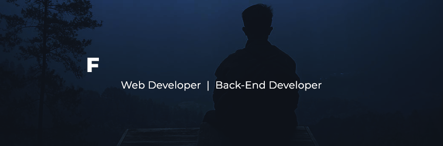

###  <h2>Hey there! I'm Farid Fatkhurrozak</h2> 
&nbsp;
&nbsp;
&nbsp;

### 👨🏻‍💻 &nbsp;About Me
💡 &nbsp;&nbsp; I like to explore new technologies and develop web application. \
🎓 &nbsp; I'm currently studying Informatics Engineering at STMIK Widya Pratama Pekalongan. \
🌱 &nbsp; I'm on track for learning more about Web Development, Android Development, and Internet of Things. \
✍️ &nbsp; In my free time, I play guitar and football as my hobbies. \
✉️ &nbsp; You can contact me by email at fatkhurrozakf@gmail.com. I will gladly respond as soon as possible. \
📄 &nbsp;&nbsp; You can check my [Portfolio Page](http://vard.my.id) for more details about project experience. 

### 🛠 &nbsp;Tech Stack
&nbsp;
&nbsp;
&nbsp;
&nbsp;
 \
&nbsp;
&nbsp;
&nbsp;
&nbsp;
&nbsp;
 \
&nbsp;
&nbsp;

